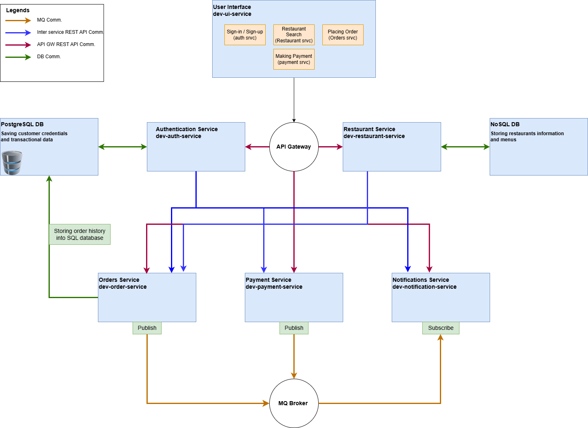

Introduction:
- Project Objective:
    - The resturama-food-app is a food delivery app MVP, founded and created with 1 goal in mind, that is being used to demonstrate QA automation framework, covering multiple stages of testing (unit, interface, intgration, E2E, performance, and security)

- High-Level Architecture:
    - The 10000 ft view at this web-based app is that it's microservice-based architecture deployed locally for testing using Docker Compose and in production-like environment using single node Kubernetes cluster, with communication between UI and backend as well as inter-services using REST APIs, and message queue for event-driven actions

- Architecture Diagram
    
